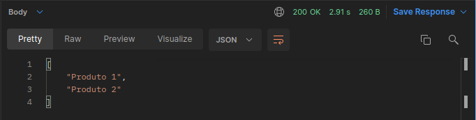
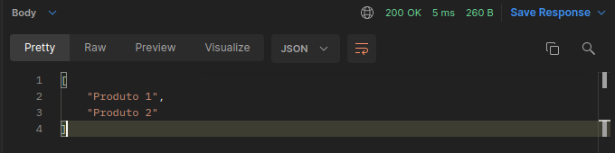

# Redis <> Node.js
> Make request more fast

## Scenery

I have a request that takes X time, but the data doesn't change often. To solve this we can use caching

A strategy is to send stale data while validating whether there is new data in the key

*Passing from 2s to 5ms*

